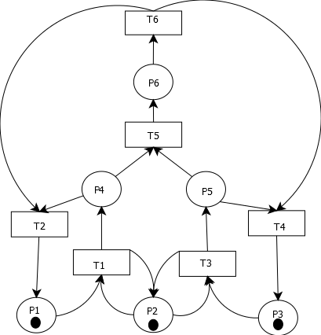
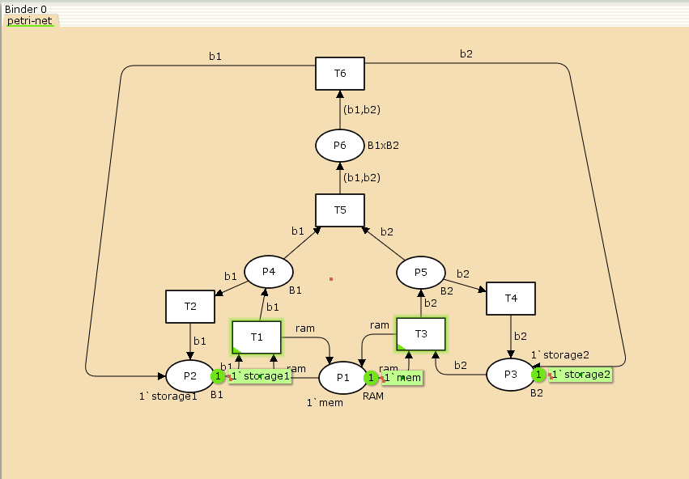
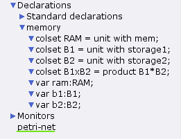
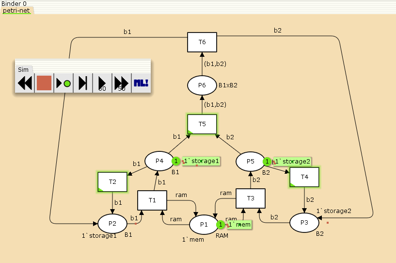
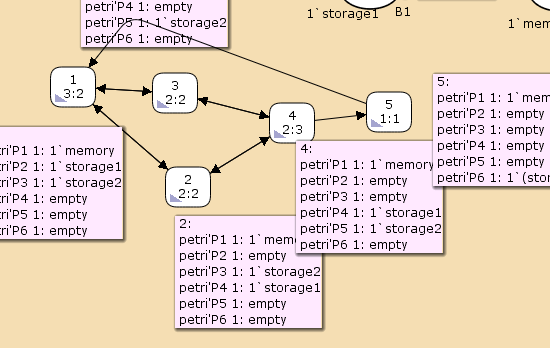

---
## Front matter
##lang: ru-RU
title: "Лабораторная работа №13"
subtitle: "Задание для самостоятельного выполнения"
author:
  "- Герра Гарсия Паола Валентина"
institute:
  "- Российский университет дружбы народов, Москва, Россия"

## i18n babel
##babel-lang: russian
##babel-otherlangs: english

## I18n polyglossia
polyglossia-lang:
  name: russian
  options:
	- spelling=modern
	- babelshorthands=true
polyglossia-otherlangs:
	name: english

## Formatting pdf
#toc: false
#toc-title: Содержание
slide_level: 2
aspectratio: 169
section-titles: true
theme: metropolis
header-includes:
 - \metroset{progressbar=frametitle,sectionpage=progressbar,numbering=fraction}
 - '\makeatletter'
 - '\beamer@ignorenonframefalse'
 - '\makeatother'
---

# Информация

## Докладчик

:::::::::::::: {.columns align=center}
::: {.column width="60%"}

  * Герра Гарсия Паола Валентина
  * студентка
  * Российский университет дружбы народов
  * [1032225472@pfur.ru](mailto:1032225472@pfur.ru)
  * <https://github.com/paovalentinag10/labs/tree/main>

:::
::: {.column width="25%"}

:::
::::::::::::::

## Постановка задачи

1. Используя теоретические методы анализа сетей Петри, провести анализ сети (с помощью построения дерева достижимости). Определить, является ли сеть безопасной, ограниченной, сохраняющей, имеются ли
тупики.
2. Промоделировать сеть Петри с помощью CPNTools.
3. Вычислить пространство состояний. Сформировать отчёт о пространстве состояний и проанализировать его.Построить граф пространства состояний.

## Описание модели

{#fig:001 width=40%}

## Анализ сети Петри

{#fig:002 width=50%}

## Реализация модели в CPN Tools

{#fig:003 width=70%}

## Реализация модели в CPN Tools

{#fig:004 width=50%}

## Реализация модели в CPN Tools

{#fig:005 width=70%}

## Пространство состояний

{#fig:006 width=70%}

## Пространство состояний

```
 Statistics
------------------------------------------------------------------------

  State Space
     Nodes:  5
     Arcs:   10
     Secs:   0
     Status: Full
```

## Выводы

В результате выполнения данной лабораторной работы я выполнила задание для самостоятельного выполнения, а именно провела анализ сети Петри, построила сеть в CPN Tools, построила граф состояний и провела его анализ.
